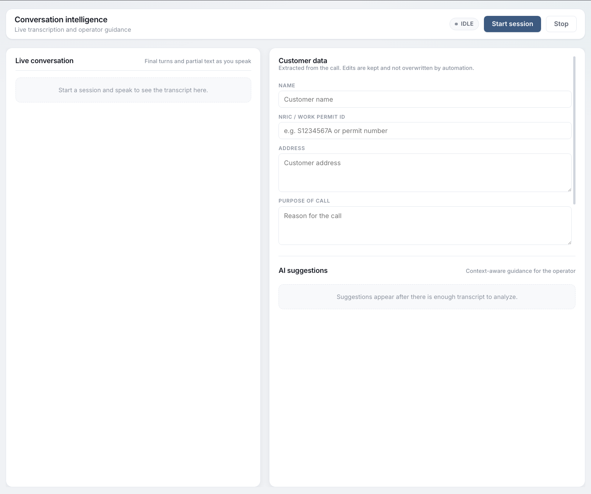

# Real-Time Conversation Intelligence

A real-time legal call assistant system that provides live AI-powered suggestions to operators during active calls with clients. Built with FastAPI backend and Next.js frontend, featuring real-time speech-to-text transcription via AssemblyAI and intelligent suggestions powered by OpenAI.



## ✨ Features

- **Real-Time Transcription**: Live speech-to-text using AssemblyAI WebSocket API (frontend connects directly for lowest latency)
- **AI-Powered Suggestions**: Intelligent, context-aware recommendations for operators
- **Legal Entity Integration**: Specialized for legal entity in singapore's legal assistance workflow
- **Live Conversation Intelligence**: Real-time analysis of ongoing conversations
- **Operator Support**: Actionable suggestions including follow-up questions, document requests, and issue identification
- **Customer Data Extraction**: Automatically extracts structured information (name, NRIC, address, purpose) from conversations

## 🚀 Quick Start

### Prerequisites

- **Python 3.11+** (check with `python3 --version`)
- **Node.js 18+** and npm (check with `node --version` and `npm --version`)
- **AssemblyAI API Key** ([Get one here](https://www.assemblyai.com/))
- **OpenAI API Key** ([Get one here](https://platform.openai.com/api-keys))

### Installation & Setup

#### 1. Clone the Repository

```bash
git clone https://github.com/yourusername/realtime-conversation-intelligence.git
cd realtime-conversation-intelligence
```

#### 2. Set Up Python Backend

```bash
# Create virtual environment
python3.11 -m venv realtime-venv

# Activate virtual environment
# On macOS/Linux:
source realtime-venv/bin/activate
# On Windows:
# realtime-venv\Scripts\activate

# Upgrade pip
pip install --upgrade pip

# Install dependencies
pip install -r requirements.txt
```

#### 3. Configure Environment Variables

Create a `.env` file in the project root directory:

```bash
# AssemblyAI for realtime transcription
ASSEMBLYAI_API_KEY=your_assemblyai_api_key_here

# OpenAI API configuration
OPENAI_API_KEY=your_openai_api_key_here
```

**Note**: Replace `your_assemblyai_api_key_here` and `your_openai_api_key_here` with your actual API keys.

#### 4. Configure Suggestion Settings (Optional)

Edit `config.json` to customize suggestion behavior:

```json
{
  "suggestion_model": "gpt-3.5-turbo",
  "suggestion_temperature": 0.3,
  "max_suggestions": 2
}
```

**Available Models**: You can use any OpenAI model (e.g., `gpt-4`, `gpt-4-turbo`, `gpt-3.5-turbo`). The default is `gpt-3.5-turbo` for cost-effectiveness.

#### 5. Set Up Frontend

```bash
cd frontend
npm install
cd ..
```

### Running the Application

#### Start the Backend Server

In your terminal (with virtual environment activated):

```bash
uvicorn backend.api:app --host 0.0.0.0 --port 8000 --reload
```

The backend will be available at `http://localhost:8000`

**Available Endpoints**:
- `GET /health` – Service health check
- `GET /config` – Configuration introspection (shows loaded keys/models)
- `POST /suggest` – AI suggestions endpoint (accepts conversation transcript)
- `POST /extract-customer-data` – Extract customer information from conversation transcript

#### Start the Frontend Development Server

Open a **new terminal** (keep backend running):

```bash
cd frontend
npm run dev
```

The frontend will be available at `http://localhost:3000`

### Usage

1. **Open the Application**: Navigate to `http://localhost:3000` in your browser
2. **Enter API Key**: Paste your AssemblyAI API key in the header input field
3. **Start Transcription**: Click the "Start" button (browser will request microphone access)
4. **Speak**: Begin speaking - partial transcript appears instantly
5. **View Suggestions**: AI-powered suggestions appear in real-time on the right side
6. **Stop**: Click "Stop" to end the transcription session

**How It Works**:
- Partial transcripts appear instantly as you speak
- When finalized, transcripts overwrite partial text (no duplicates)
- AI suggestions are generated automatically from finalized transcript turns
- Suggestions update in real-time as the conversation progresses

## 🏗️ Architecture

### How It Works

1. **Real-Time Transcription (Frontend)**: 
   - Frontend streams audio directly to AssemblyAI over WebSocket
   - Partial text renders immediately
   - Final text overwrites partial to avoid duplicates

2. **Transcript Analysis (Backend)**: 
   - Finalized transcript turns are posted to `/suggest` endpoint
   - Backend processes conversation context

3. **AI Suggestions (Two-Agent Pipeline)**:
   - **Router Agent**: Analyzes conversation and decides when suggestions are needed
   - **Suggestion Agent**: Generates actionable recommendations including:
     - Follow-up questions to gather essential information
     - Legal issue identification
     - Document requests
     - Urgency assessment
     - Natural language responses for operators

4. **Customer Data Extraction**: 
   - `/extract-customer-data` endpoint extracts structured information (name, NRIC, address, purpose) from conversation transcripts using AI

## 📁 Project Structure

```
realtime-conversation-intelligence/
├── backend/                    # FastAPI backend
│   ├── api.py                 # FastAPI application and routes
│   ├── suggestions.py         # Two-agent AI suggestion endpoint
│   ├── router_agent.py        # Router agent logic
│   ├── suggestion_agent.py    # Suggestion agent logic
│   ├── customer_data_extractor.py  # Customer data extraction
│   ├── prompt_loader.py       # Prompt loading utility
│   ├── assemblyai_ws.py       # Optional WebSocket proxy
│   ├── config.py              # Environment and configuration
│   └── prompts/               # Editable prompt files
│       ├── router_system_prompt.txt
│       ├── router_user_prompt.txt
│       ├── suggestion_system_prompt.txt
│       ├── suggestion_user_prompt.txt
│       └── fallback_suggestions.json
├── frontend/                  # Next.js frontend
│   ├── app/
│   │   ├── page.tsx           # Main conversation UI
│   │   └── layout.tsx          # Next.js layout
│   └── package.json
├── database_setup/            # Optional RAG setup
│   ├── pdf_processor.py
│   └── pinecone_setup.py
├── config.json                # Suggestion settings
├── requirements.txt           # Python dependencies
└── README.md                  # This file
```

## 🎨 Customization

### Customizing AI Prompts

All AI prompts are stored in separate files for easy customization. Edit the files in `backend/prompts/` to modify agent behavior:

**Router Agent Prompts** (controls when suggestions are generated):
- `router_system_prompt.txt` – System instructions for the router agent
- `router_user_prompt.txt` – User prompt template (uses `{conversation_transcript}` placeholder)

**Suggestion Agent Prompts** (controls what suggestions are generated):
- `suggestion_system_prompt.txt` – System instructions for the suggestion agent
- `suggestion_user_prompt.txt` – User prompt template (uses `{conversation_transcript}` and `{max_suggestions}` placeholders)

**Fallback Suggestions** (shown when the AI fails):
- `fallback_suggestions.json` – JSON array of fallback suggestion objects

**Note**: Prompt files support template placeholders (e.g., `{conversation_transcript}`) which are automatically replaced at runtime. Do not modify these placeholders unless you understand the code structure.

Changes take effect after restarting the backend server.

## 🔧 Optional: RAG Setup with Pinecone

For enhanced legal document retrieval, you can set up a Pinecone vector database:

**Install RAG dependencies**:
```bash
pip install PyPDF2 langchain_text_splitters langchain-core langchain-openai langchain-pinecone pinecone-client
```

**Add to `.env`**:
```
PINECONE_API_KEY=your_pinecone_key
PINECONE_INDEX_NAME=legal-documents
PINECONE_REGION=us-east-1
PINECONE_CLOUD=aws
```

**Process and index documents**:
```bash
cd database_setup
python pinecone_setup.py
```

## 🐛 Troubleshooting

### Common Issues

**Microphone not working**:
- Check browser permissions (allow microphone access when prompted)
- Ensure your AssemblyAI API key is present in the UI
- Try refreshing the page and granting permissions again

**Suggestions not appearing**:
- Verify `OPENAI_API_KEY` is configured in your `.env` file
- Check that you have sufficient OpenAI API credits
- Review backend logs for error messages
- Test the `/config` endpoint: `curl http://localhost:8000/config`

**Backend connection issues**:
- Ensure backend is running on port 8000
- Check that virtual environment is activated
- Verify all dependencies are installed: `pip list`
- Review FastAPI logs for detailed error messages

**Frontend connection issues**:
- Ensure frontend is running on port 3000
- Check that backend is accessible at `http://localhost:8000`
- Verify CORS settings if accessing from different origin
- Ensure AssemblyAI WebSocket can connect (corporate networks may require allowing `wss://streaming.assemblyai.com`)

**Duplicate lines in conversation**:
- The UI normalizes final vs partial transcripts automatically
- If duplicates persist, refresh the page and try again
- Check browser console for errors

### Debugging

**Backend Logging**: The suggestions endpoint provides detailed logging:
- Input conversation transcripts with character counts
- API call details (model, request parameters)
- Output suggestions with type, text, confidence, priority
- Error traces and fallback suggestions

**Check Backend Health**:
```bash
curl http://localhost:8000/health
```

**Check Configuration**:
```bash
curl http://localhost:8000/config
```

## 📝 Notes

- CORS is configured permissively for development (`allow_origins=["*"]`). **Restrict this for production**.
- The backend provides comprehensive logging for all suggestion requests, making it easy to debug and monitor the system.
- Suggestions are generated in real-time from finalized transcript turns and update automatically.
- The system is optimized for legal entity in singapore's workflow, providing context-aware recommendations for legal assistance operators.

## 📄 License

See [LICENSE](./LICENSE) file for details.

## 🤝 Contributing

Contributions are welcome! Please feel free to submit a Pull Request.

## 📧 Support

For issues and questions, please open an issue on GitHub.
