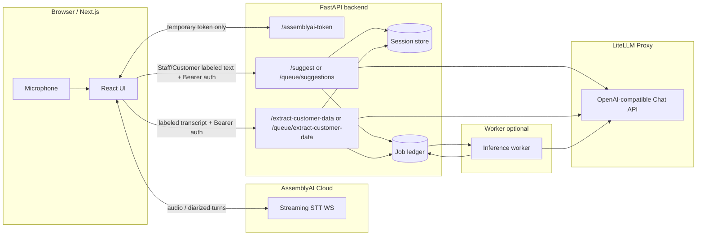

# Technical documentation — how the system runs, options, and production readiness

This document is aimed at **data scientists**, **MLEs**, and **technical operators** who need to understand end-to-end behavior, configuration knobs, reproducibility (“no surprise drift”), and observability — not only ML code paths but API, infra, and data flow.

Companion docs:

- [`PRODUCTION_CHECKLIST.md`](./PRODUCTION_CHECKLIST.md) — concise go-live checklist.
- [`../README.md`](../README.md) — quick start, endpoint list.
- [`../infra/aws/README.md`](../infra/aws/README.md) — App Runner, DynamoDB, Cognito.

---

## 1. What the system does

**Goal:** Live **speech-to-text** on the client’s microphone, streamed to **AssemblyAI** with **streaming speaker diarization**, with **finalized role-labeled transcript segments** periodically sent to a **FastAPI backend** that runs:

1. A **two-step LLM pipeline** (router → suggestion generator),
2. A **structured extraction** endpoint (customer fields from **Customer**-attributed transcript lines), and/or  
3. A **read-only customer-history lookup** against a curated Postgres view,

with LLM calls routed through a **LiteLLM-hosted OpenAI-compatible proxy**, optionally persisted per **session** and optionally executed **asynchronously** via a **worker** where applicable.

**Important boundary:** Permanent **AssemblyAI** and **LiteLLM** credentials stay on the server. The browser receives only a **short-lived streaming token** from `GET /assemblyai-token` (see [`backend/api.py`](../backend/api.py)).

**Speaker roles:** The frontend enables AssemblyAI `speaker_labels=true` (`max_speakers=2`) on the streaming WebSocket, maps A/B labels to Staff/Customer (with operator lock + swap), and posts context like `Staff: …` / `Customer: …`. This is a **same-laptop single-mic** path (in-person or speakerphone), not dual-channel telephony.

---

## 2. Logical architecture



**Sync vs async:**

| Mode | When to use | Client |
|------|-------------|--------|
| **Sync** | Simple deployment, moderate load | `POST /suggest`, `POST /extract-customer-data` |
| **Async** | Decouple inference from HTTP; scale workers | `POST /queue/*` + poll `GET /queue/jobs/{job_id}`; frontend flag `NEXT_PUBLIC_USE_ASYNC_JOBS=true` |

Async requires `ASYNC_JOBS_ENABLED=true`, a configured **job store** (`JOB_STORE_BACKEND`), and a running **worker** container or process (`Dockerfile.worker`, `worker` service in [`docker-compose.yml`](../docker-compose.yml)).

---

## 3. How to run everything

### 3.1 Local (no Docker)

1. **Backend** — from repo root with Python 3.11+:

   ```bash
   python -m venv .venv && source .venv/bin/activate
   pip install -r requirements.txt
   cp .env.example .env   # fill keys
   uvicorn backend.api:app --host 0.0.0.0 --port 8000 --reload
   ```

2. **Frontend**:

   ```bash
   cd frontend && npm install && npm run dev
   ```

Point the UI at your backend (`NEXT_PUBLIC_BACKEND_URL` at build/run time or the URL override documented in [`frontend/app/page.tsx`](../frontend/app/page.tsx)).

### 3.2 Docker Compose (three services)

```bash
docker compose up --build
```

- **backend** — API on `:8000`, healthcheck hits `GET /health`.
- **frontend** — Next.js on `:3000`; build args bake `NEXT_PUBLIC_*` values.
- **worker** — only needed when async jobs + poll/SQS modes are configured; shares `backend_data` volume with SQLite-backed stores.

SQLite paths in Compose default to **`/data/sessions.db`** on the volume (see [`docker-compose.yml`](../docker-compose.yml)).

### 3.3 AWS (outline)

Two App Runner services (backend image + frontend image), DynamoDB optional for persistence, Cognito-compatible JWT env vars optional. Details: [`infra/aws/README.md`](../infra/aws/README.md).

### 3.4 Tests and smoke probes

```bash
pip install -r requirements.txt -r requirements-dev.txt
pytest
```

Concurrency probe against **`/health`** (no auth):

```bash
BASE_URL=http://127.0.0.1:8000 python scripts/load_smoke.py
```

---

## 4. Configuration: three layers data scientists care about

### 4.1 Environment variables (`backend/config.py`)

| Area | Variables | Meaning |
|------|-----------|---------|
| **LLM/STT secrets** | `LLM_API_KEY`, `LLM_BASE_URL`, `ASSEMBLYAI_API_KEY` | Server-side only; `LLM_BASE_URL` and `LLM_API_KEY` are both required for the LiteLLM/OpenAI-compatible proxy path; `/ready` with `STRICT_READINESS=true` fails if LLM or STT credentials are missing. |
| **Auth** | `REQUIRE_API_AUTH`, `API_AUTH_TOKEN`, `AUTH_JWKS_URL`, `AUTH_ISSUER`, `AUTH_AUDIENCE` | If `REQUIRE_API_AUTH=true`, either static bearer token hash or JWT (Cognito/OIDC-style). Frontend stores Cognito-derived token in localStorage (`AUTH_ACCESS_TOKEN`, etc.). |
| **CORS** | `BACKEND_CORS_ORIGINS` | Comma-separated allowlist — **must match** real frontend origins in production. |
| **Quotas** | `RATE_LIMIT_PER_MINUTE`, `DAILY_REQUEST_QUOTA` | Per **auth user key** (see [`backend/auth.py`](../backend/auth.py)) — in-memory ledger; resets on process restart unless you extend it. |
| **Sessions** | `STORAGE_BACKEND` (`sqlite` \| `dynamodb` \| `none`), `SQLITE_DB_PATH`, `DYNAMODB_CONVERSATIONS_TABLE`, `AWS_REGION` | Where transcript snapshots and events are recorded. |
| **Async jobs** | `ASYNC_JOBS_ENABLED`, `JOB_STORE_BACKEND`, `INFERENCE_QUEUE_MODE` (`poll` \| `sqs`), `AWS_SQS_INFERENCE_QUEUE_URL` | Job queue + worker model. Dynamo job store + poll mode is intentionally disallowed — use **SQS** ([`worker.py`](../backend/worker.py)). |
| **Customer history** | `CUSTOMER_HISTORY_DATABASE_URL`, `CUSTOMER_HISTORY_VIEW`, `CUSTOMER_HISTORY_QUERY_TIMEOUT_MS`, `CUSTOMER_HISTORY_MAX_ROWS` | Read-only Postgres lookup against a curated customer-history view; intended for operator context, not arbitrary SQL execution. |
| **Observability** | `LOG_JSON`, `LOG_LEVEL`, `APP_VERSION`, `GIT_SHA`, `METRICS_ENABLED`, `METRICS_TOKEN`, `STRICT_READINESS` | Structured logs, Prometheus `/metrics`, readiness strictness — see §7. |

**`.env.example`** is the authoritative list for copy-paste; values are loaded with **override from `.env`** via `python-dotenv` in [`config.py`](../backend/config.py).

### 4.2 `config.json` (model + retrieval-like tuning)

Stored at repo root [`config.json`](../config.json), read at startup:

| Field | Role |
|-------|------|
| `router_model` | Default model name for the lightweight routing/gating decision. |
| `suggestion_model` | Default model name for operator suggestions. |
| `extraction_model` | Default model name for structured customer-field extraction. |
| `sql_lookup_model` | Reserved model slot for future SQL/NL retrieval layers; the first customer-history release is deterministic and view-based. |
| `suggestion_temperature` | Sampling temperature for generation. |
| `max_suggestions` | Upper bound routed into agents (bounded by runtime `max_suggestions` on payloads where applicable). |
| `assemblyai_keyterms` | Up to ~100 boosted terms forwarded as **streaming** hint (not a substitute for fine-tuning). |

**Change management:** Any edit requires a **backend restart** (or new container revision). It does **not** auto-version in the database — you should align changes with **`APP_VERSION` / `GIT_SHA`** in deploy env for traceability.

### 4.3 Prompt files (behavior “version”)

Text prompts live under [`backend/prompts/`](../backend/prompts/):

- `router_system_prompt.txt`, `router_user_prompt.txt`
- `suggestion_system_prompt.txt`, `suggestion_user_prompt.txt`

These define **router** and **suggestion** behavior more than `config.json` alone. Treat them like **code**: review in PRs, tag releases, and pair with **`GIT_SHA`** in production logs so offline analysis can map outputs to exact prompt text.

Fallback behavior when the LLM path fails uses [`fallback_suggestions.json`](../fallback_suggestions.json) (see suggestion core / agents).

---

## 5. Data flow and persistence (for evaluation & drift analysis)

### 5.1 What gets stored

If the client sends a **`session_id`** (after `POST /sessions/`) and the session is **owned** by the same auth user key, events are appended via [`persistence.py`](../backend/persistence.py):

- **`suggestions.response`** — model output (and errors if any) tied to a transcript snapshot.
- **`customer_data.extract`** — extraction result or error.
- **`customer_history.lookup`** — read-only customer-history lookup inputs and response payload.

Session store implementation: [`session_store.py`](../session_store.py) (`sqlite` | `dynamodb` | `none`).

**Implication for DS:** You can build **offline evaluation sets** from stored events *if* sessions are enabled and retention is allowed by policy. There is **no** built-in PII scanner — treat transcripts as **sensitive** (see §8).

### 5.2 What is *not* automatically stored

- Raw audio is **not** persisted by this app (only goes to AssemblyAI per their product flow).
- Full LLM request/response bodies are **not** stored as structured fields by default; verbose **logs** may contain transcript snippets — lock down logs in production (`LOG_JSON` + access controls).

---

## 6. “No data drift” and reproducibility — what is realistic here

This repo does **not** ship automated **data drift detectors** or **prediction drift monitors** (e.g. PSI, KL on embedding distributions). Production readiness instead comes from **governance hooks** you combine with your own pipelines.

### 6.1 Configuration and code drift

| Risk | Mitigation in this codebase |
|------|------------------------------|
| Model / prompts change without visibility | Deploy with **`GIT_SHA`** + **`APP_VERSION`**; log them via `/health` / `/ready`; store `config.json` in repo with tagged releases. |
| Different backends for dev vs prod | Same Docker images through environments; freeze **`config.json`** in the image or mount consistently; avoid hand-editing prod `config.json` without changelog. |
| Async vs sync differences | Same core inference in **`suggestions_core.py`** / worker runtime — validate both paths if you enable async. |

### 6.2 Input / label drift (operational ML)

Recommended **outside** this repo but enabled by persisted events:

1. **Slice metrics** — by session length, locale, **speaker role** (Staff/Customer labels in stored transcripts), router `should_suggest`, etc.
2. **Offline regression** — golden transcripts with expected extraction fields / suggestion archetypes when you freeze a **prompt hash** + **`suggestion_model`**. Prefer labeled `Staff:` / `Customer:` fixtures so extraction attribution is testable.
3. **Shadow / A-B** — run an alternate model in batch on stored transcripts (no built-in routing); compare before switching `config.json`.

### 6.3 LLM vendor drift

Upstream LLM providers behind LiteLLM, and AssemblyAI decoding, can change subtly over time without your code changing. Mitigations:

- Pin **`suggestion_model`** to stable model IDs you trust; document allowances for upgrades.
- Record **approximate timestamps** (`suggestions.response` events are tied to session times in store) and correlate with vendor incident windows.
- For high-stakes use, retain periodic **evaluation harness** outputs (golden set) keyed by **`GIT_SHA`**.

---

## 7. Telemetry, health checks, and SLO-minded operations

### 7.1 Logging

- **`LOG_JSON=true`** → one JSON object per line (good for Datadog / CloudWatch Logs Insights).
- **`X-Request-ID`** on responses; echoed in structured logs (`request_id` field in JSON mode).
- Access line per request includes method, path, status, latency (see [`http_middleware.py`](../backend/http_middleware.py)).

**Data-science caveat:** Detailed suggestion logs (`suggestions_core.py`) can include **full transcripts** — restrict log access and consider **redacting** before centralizing analytics.

### 7.2 Metrics (Prometheus)

When **`METRICS_ENABLED=true`**:

- `GET /metrics` exposes counters/histograms with **low-cardinality** `path_group` labels (`metrics_prom.py`).
- Optional **`METRICS_TOKEN`** protects the scrape URL on untrusted networks.

Useful for latency SLOs, error ratios, and traffic shape — **not** for semantic quality of suggestions (pair with labeled eval).

### 7.3 Liveness vs readiness

| Endpoint | Use |
|---------|-----|
| `GET /health` | **Liveness:** process responding; cheap; suitable for Compose healthchecks. Includes `version` / `git_sha` when configured. |
| `GET /ready` | **Readiness:** surfaces whether LiteLLM proxy and AssemblyAI configuration are present; **`STRICT_READINESS=true`** returns **503** if either is missing — gate load balancers that should not admit traffic until secrets exist. |

---

## 8. Privacy, governance, and rate limits

- **Auth identifiers** for quotas are derived from JWT `sub` or hashed static token ([`auth.py`](../backend/auth.py)) — design **tenant isolation** consciously if sharing one deployment.
- **Usage limits are in-memory** per process → new replica = separate counters unless you refactor to Redis/Dynamo counters.
- **Retention / deletion**: define policy for SQLite files or DynamoDB PKs (`SESSION#...`); not automated here.
- **Legal / GDPR / sector rules:** NRIC-like fields appear in extraction schema — classify data and restrict access before enabling broad session persistence.

---

## 9. API surface (operator map)

Stable operational reads:

| Method | Path | Notes |
|--------|------|--------|
| GET | `/health` | Liveness + build metadata |
| GET | `/ready` | Dependency readiness |
| GET | `/metrics` | Prometheus (if enabled) |
| GET | `/config` | Introspection (auth when enforced) |
| GET | `/limits` | Rate & quota knobs |
| GET | `/assemblyai-token` | Short-lived streaming token (+ optional keyterms hint) |

Inference write paths remain `POST /suggest`, `POST /extract-customer-data`, and optional **`/queue/*`** when async is on.

Full list maintained in [`README.md`](../README.md).

---

## 10. Mental model checklist for data scientists onboarding

1. **Where does “the model” live?** → Behind your LiteLLM OpenAI-compatible endpoint, driven by **`config.json`** + **prompt `.txt`** files + agent code (`router_agent.py`, `suggestion_agent.py`, `customer_data_extractor`).
2. **What changes output without a redeploy?** → Vendor-side model drift; ephemeral temperature sampling; streamed partial transcripts triggering different routers.
3. **What freezes behavior for forensics?** → **`GIT_SHA`**, **`APP_VERSION`**, image digest, **`config.json`**, Git revision of **`backend/prompts/`**.
4. **Where is ground truth for quality?** → Not auto-generated; use stored session events plus human labels or SME review — build pipelines accordingly.
5. **What proves production readiness?** → Secrets not in browser; auth + CORS; quotas; persistence backend choice; optional async + SQS; structured logs + metrics; [`PRODUCTION_CHECKLIST.md`](./PRODUCTION_CHECKLIST.md).

---

*Last oriented to the repository layout and env flags as documented in code; extend this file when you add new backends, eval exporters, or drift jobs.*
